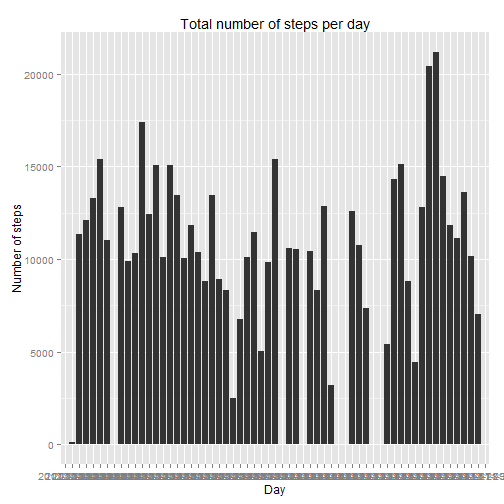
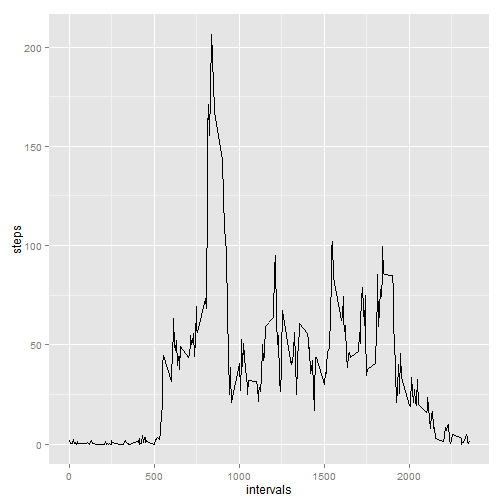
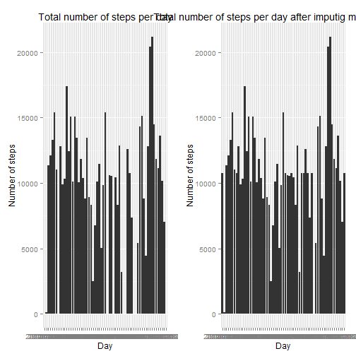
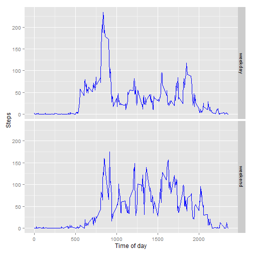

## Loading and preprocessing the data

#### Loading the required libraries

```r
library(ggplot2)
library(plyr)
library(dplyr)
library(grid)
```

#### Loading data

```r
setwd("E:/github/RepData_PeerAssessment1")
activities <- read.csv("activity.csv")
```
## What is mean total number of steps taken per day?

1- Calculating the total number of steps taken per day

```r
stepsDaySum <- aggregate(activities$steps, by=list(activities$date), FUN=sum,na.rm=TRUE)
names(stepsDaySum) <- c("day", "steps")
```

2- Histogram of the total number of steps taken each day

```r
stepsHist <- ggplot(data=stepsDaySum, aes(x =factor(stepsDaySum$day) ,y = stepsDaySum$steps)) 
stepsHist = stepsHist + geom_bar(stat = "identity") 
stepsHist = stepsHist + ggtitle("Total number of steps per day") 
stepsHist = stepsHist + xlab("Day")  
stepsHist = stepsHist + ylab("Number of steps")
print(stepsHist)
```

 

3- Mean of the total number of steps taken per day

```r
avgSteps <- mean(stepsDaySum$steps,na.rm=TRUE)
avgSteps
```

```
## [1] 9354.23
```
4- Median of the total number of steps taken per day

```r
medianSteps <- median(stepsDaySum$steps,na.rm=TRUE)
medianSteps
```

```
## [1] 10395
```

## What is the average daily activity pattern?
##### Average of steps grouped by the 5-minute interval accross all days

```r
stepsIntervalAvg <- aggregate(activities$steps, by=list(activities$interval), FUN=mean, na.rm = TRUE)
names(stepsIntervalAvg) <- c("interval", "steps")
```
##### Time series plot of the 5-minute interval (x-axis) and the average number of steps taken, averaged across all days (y-axis)

```r
qplot(x=stepsIntervalAvg$interval,y=stepsIntervalAvg$steps,geom = "line",xlab = "intervals",ylab = "steps")
```

 
##### 5-minute interval, on average across all the days with max number of steps

```r
maxIndex <- which.max(stepsIntervalAvg$steps)
stepsIntervalAvg[maxIndex,]
```

```
##     interval    steps
## 104      835 206.1698
```

## Imputing missing values
1- Total number of missing values in the dataset

```r
completeVect <- complete.cases(activities)
missinValNum <- length(completeVect) - length(completeVect[completeVect == TRUE])
missinValNum
```

```
## [1] 2304
```

2- Filling in all of the missing values in the dataset by the the mean for that 5-minute interval in  new dataset

```r
activitiesNew <- activities
activitiesNew <- mutate(activitiesNew, steps = 
         ifelse(is.na(steps),
                stepsIntervalAvg$steps[match(activitiesNew$interval[row_number()], stepsIntervalAvg$interval )],
                steps))
```
3- Mean and median total number of steps taken per day before and after imputing

```r
stepsDaySumImp <- aggregate(activitiesNew$steps, by=list(activitiesNew$date), FUN=sum,na.rm=TRUE)
names(stepsDaySumImp) <- c("day", "steps")
avgStepsImp <- mean(stepsDaySumImp$steps,na.rm=TRUE)
print(paste0("Mean of steps before imputing:" ,avgSteps))
```

```
## [1] "Mean of steps before imputing:9354.22950819672"
```

```r
print(paste0("Mean of steps after imputing: " , avgStepsImp))
```

```
## [1] "Mean of steps after imputing: 10766.1886792453"
```

```r
medianStepsImp <- median(stepsDaySumImp$steps,na.rm=TRUE)
print(paste0("Median of steps before imputing: " , medianSteps))
```

```
## [1] "Median of steps before imputing: 10395"
```

```r
print(paste0("Median of steps after imputing: " ,medianStepsImp))
```

```
## [1] "Median of steps after imputing: 10766.1886792453"
```
3- Histogram of the total number of steps taken each day before and after imputing

```r
stepsHistImp <- ggplot(data=stepsDaySumImp, aes(x =factor(stepsDaySumImp$day) ,y = stepsDaySumImp$steps)) 
stepsHistImp = stepsHistImp + geom_bar(stat = "identity") 
stepsHistImp = stepsHistImp + ggtitle("Total number of steps per day after imputig missing values") 
stepsHistImp = stepsHistImp + xlab("Day")  
stepsHistImp = stepsHistImp + ylab("Number of steps")

# Define grid layout to locate plots and print each graph
pushViewport(viewport(layout = grid.layout(1, 2)))
print(stepsHist, vp = viewport(layout.pos.row = 1, layout.pos.col = 1))
print(stepsHistImp, vp = viewport(layout.pos.row = 1, layout.pos.col = 2))
```

 

## Are there differences in activity patterns between weekdays and weekends?
1- Creating new factor variable in the dataset with two levels - "weekday" and "weekend" indicating whether a given date is a weekday or weekend day.


```r
dayActivities <- activities
dayActivities$weekday <- weekdays(as.Date(activities$date))
dayActivities$weekday[dayActivities$weekday == "Saturday" | dayActivities$weekday == "Sunday"] <- "weekend"
dayActivities$weekday[dayActivities$weekday != "Saturday" & dayActivities$weekday != "Sunday" &dayActivities$weekday != "weekend" ] <- "weekday"
dayActivities$weekday = as.factor(dayActivities$weekday)
```

2- Panel plot containing a time series plot of the 5-minute interval (x-axis) and the average number of steps taken, averaged across all weekday days or weekend days (y-axis).


```r
stepsAvg <- aggregate(dayActivities$steps, by=list(dayActivities$interval,dayActivities$weekday), FUN=mean, na.rm = TRUE)
names(stepsAvg) <- c("interval","weekday", "steps")
ggplot(data = stepsAvg, aes(x = interval, y = steps))  +
  geom_line(color = "blue") +      labs(y = "Steps", x = "Time of day")  + facet_grid(weekday ~ .)
```

 
